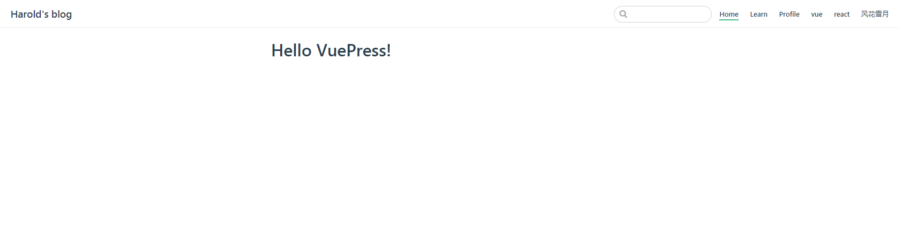

# VuePress从零开始搭建专属博客

## 简介

欢迎使用我的指南，了解如何使用[VuePress](https://github.com/harold1024/blog/)! 这个项目的产生是出于使用 [VuePress](https://vuepress.vuejs.org) 作为我的博客引擎的愿望，并且没有明确的途径.

### VuePress是什么？

VuePress是以Vue驱动的静态网站生成器，是一个由Vue、Vue Router和webpack驱动的单页应用。在VuePress中，你可以使用Markdown编写文档，然后生成网页，每一个由VuePress生成的页面都带有预渲染好的HTML，也因此具有非常好的加载性能和搜索引擎优化。同时，一旦页面被加载，Vue将接管这些静态内容，并将其转换成一个完整的单页应用，其他的页面则会只在用户浏览到的时候才按需加载。

### 版本

该项目目前位于 `version {{ $themeConfig.version }}`.

### 目的

该项目的目标很简单:

> 记录我使用[VuePress](https://vuepress.vuejs.org/)搭建博客的全过程,以便以后翻阅学习,同时希望可以帮到你,为你提供多样的选择,您根据自己的喜好自定义它。

### 功能

为什么要使用VuePress搭建博客呢,除了[VuePress](https://vuepress.vuejs.org/)自带的出色功能之外,您还可以立即使用以下工具：

- 自动生成主页上的最新帖子
- 简单的Google Analytics（分析）配置
- 自动RSS提要生成
- 简单的图标配置
- 主页上的简单分页
- 所有帖子的存档页面按日期排序

小菜一碟吧？那就不要时间浪费了，让我们开始吧！

## 入门

### 准备

- [NodeJS >= 8](https://nodejs.org/)
- [yarn](https://yarnpkg.com/lang/en/docs/install/) (可选)
- nodeJS以及vue基础知识

## 安装

<!-- ::: tip
If your plan is follow the tutorial all the way through to deployment, make sure you fork this project instead of simply cloning it!
::: -->

### 全局安装VuePress

```
yarn global add vuepress # 或者：npm install -g vuepress
```

### 创建项目目录

```
mkdir project
cd project
```

### 初始化项目

```
yarn init -y # 或者 npm init -y
```

### 新建docs文件夹

> docs文件夹作为项目文档根目录，主要放置Markdown类型的文章和.vuepress文件夹。

```bash
# 新建一个 docs 文件夹
mkdir docs

# 进入docs文件夹 创建 README.md文件
echo '# Hello VuePress!' > README.md
```

### 设置package.json

> VuePress中有两个命令，vuepress dev docs命令运行本地服务，通过访问http://localhost:8080即可预览网站，vuepress build docs命令用来生成静态文件，默认情况下，放置在docs/.vuepress/dist目录中，当然你也可以在docs/.vuepress/config.js中的dest字段来修改默认存放目录。在这里将两个命令封装成脚本的方式，直接使用npm run docs:dev和npm run docs:build即可。

```
{
  "scripts": {
    "docs:dev": "vuepress dev docs",
    "docs:build": "vuepress build docs"
  }
}
```

- 此时运行命令
```
npm run  docs:dev
```
运行访问[http://localhost:8080/](http://localhost:8080/),(此时页面空白并无内容)

- 结束运行,执行命令
```
npm run docs:build
```

::: tip
- 查看文件变化 多了个node_modules 
- docs 多了个 .vuepress文件
:::

### 配置config.js
 
```bash
# 在.vuepress 创建config.js 文件 
# 在config.js 添加配置信息
module.exports = {
  title: 'Harold\'s blog',
  description: '描述',
  head: [ // 注入到当前页面的 <head> 中的标签
    ['link', { rel: 'icon', href: '/logo.png' }],
    ['link', { rel: 'manifest', href: '/logo.png' }],
    ['link', { rel: 'apple-touch-icon', href: '/logo.png' }],
  ],
  serviceWorker: true, // 是否开启 PWA
  base: '/blog/', // 部署到github相关的配置
  markdown: {
    lineNumbers: true // 代码块是否显示行号
  },
  themeConfig: {
    // 导航栏配置
    nav:[
      {text: 'Home', link: '/' },
      {text: 'Learn', link: '/learn/' },
      {text: 'Profile', link: '/profile/' },
      {text: 'vue', link: '/vue/' },
      {text: 'react', link: '/react/' },
      {text: '风花雪月', link: '/风花雪月/' }
    ],
    version: '0.11.0-beta'
  }
}
```
### 运行项目
```
npm run  docs:dev
```



::: tip
自此项目已成功完成了技术文档的基本模型,如需个性化的配置可通过官网按需求优化；
:::
